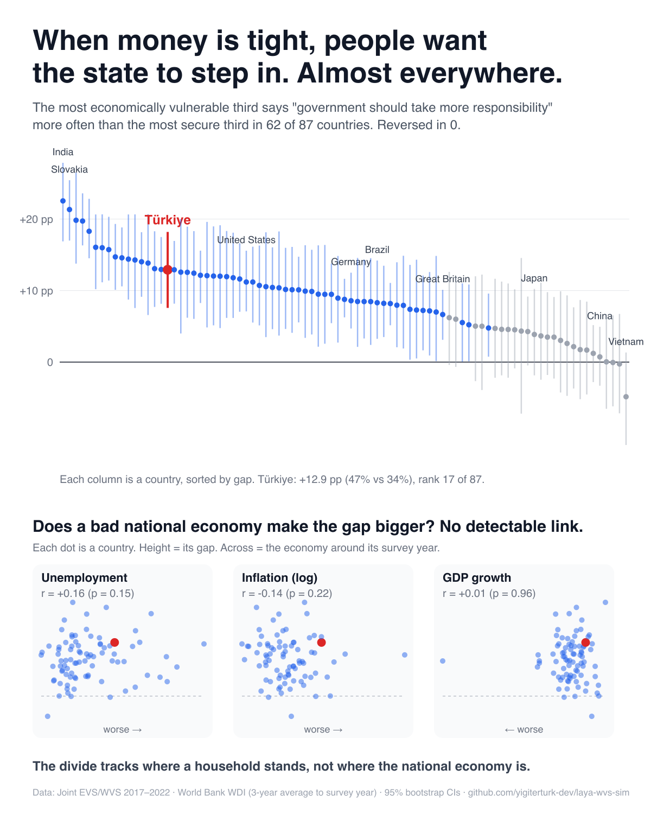

# laya-wvs-sim

**When money is tight, do people want the state to step in?** Survey evidence from 87 countries, a test against real macroeconomic conditions, and an agent-based simulation seeded from real World Values Survey respondents.



## Headline (Joint EVS/WVS 2017–2022, 87 countries)

- In **62 of 87** countries, the most economically vulnerable third is significantly more likely to say "the government should take more responsibility to ensure everyone is provided for" (E037, 7–10). The pattern significantly reverses in **0** countries. The median gap is +8.8 pp.
- The result is robust to splitting by household income alone: 68 of 87 significant, 0 reversed.
- **Türkiye:** +12.9 pp (47% vs 34%), rank 17 of 87. The income-only gap is +14.9 pp [+10.4, +19.6].
- Largest gaps: India, Slovakia, Tunisia, Canada, Czechia. No gap: Vietnam, Morocco, Kazakhstan, Ethiopia, China.
- **The national economy does not explain the gap.** Set against World Bank data (average of the survey year and the two years before), the gap shows no detectable relationship with unemployment (Spearman r = +0.16 [−0.05, +0.38], p = 0.15), inflation (r = −0.14 [−0.36, +0.08], p = 0.22) or GDP growth (r = +0.01 [−0.21, +0.24], p = 0.96). Countries surveyed during the pandemic (2020+) do not differ either: +8.1 pp vs +9.2 pp, p = 0.38. This is a between-country comparison at one point in time; it cannot rule out that a country's gap moves during its own crisis.
- The simulation layer is a **weak result**. The expected ceiling effect points the right way, with a correlation of −0.28, but it separates from the placebo in only 9 of 87 countries. The model mechanism dominates the data structure.

Report: `out/crossnational.html`. Reproduce: `python3 cross.py --csv /path/to/EVS_WVS_Joint_Csv_v5_0.csv` (~2 min; add `--no-macro` to skip the World Bank step), then `python3 figure.py` for the shareable figure.
World Bank series are fetched once from the public WDI API and cached in `out/worldbank.json`, so reruns are offline and identical.
CIs in the descriptive layer come from a respondent bootstrap, so they reflect survey sampling error. The pattern is an association, not a causal effect.

---

## Single-country deep dive: Türkiye

Honest framing: this does **not** predict how Turkish society behaves. Each crisis mechanism is an explicit assumption. The real survey data decides *who* an assumption hits and how hard. The experiment design (paired seeds, bootstrap CIs, sensitivity sweep, placebo) shows what follows from those assumptions and what does not.

## What it does

1. **Data.** Reads the official Joint EVS/WVS 2017–2022 CSV (v5.0) in place and keeps the 2,415 Türkiye respondents (`cntry = 792`). Variables are mapped according to the codebook:

   | Variable | Code | Used for |
   |---|---|---|
   | Government vs people responsibility (1–10) | E037 | initial stance (−1 / 0 / +1) |
   | Importance of God (1–10) | F063 | homophily |
   | Household income step (1–10) | X047_WVS7 | homophily, vulnerability |
   | Employment status | X028 | vulnerability |
   | Life satisfaction (1–10) | A170 | vulnerability |
   | Generalised trust | A165 | homophily |
   | Confidence in government | E069_11 | trust-building scenario |
   | Education (3-level) | X025R | homophily, groups |
   | Post-stratification weight | pwght | agent sampling |

   Negative codes (don't know / no answer) are treated as missing, never as a substantive answer.

2. **Model.** 10,000 agents are sampled from the respondents by survey weight. In each round agents meet in random pairs. A listener moves one step toward the speaker's stance with a probability that grows with homophily, the listener's openness and the speaker's influence.

3. **Scenarios** (all as assumptions):
   - `entrenchment`: economically vulnerable agents become less open to persuasion.
   - `drift`: vulnerable agents drift toward "government should take more responsibility".
   - `trust_building`: agents who trust the government become more open.

4. **Experiment design.**
   - Each scenario is compared with the baseline over 20 seeds. Both use the same seed, so they start from the same population and share the same random-number streams.
   - Results are reported with 95% bootstrap CIs.
   - A sensitivity sweep runs strengths from 0.2 to 1.0.
   - A placebo run shuffles every attribute independently. This keeps the marginal distributions and breaks the joint structure, which separates effects of real data structure from effects of the mechanism alone.

## Results (Türkiye, 10,000 agents, 10 rounds, 20 seeds)

| Scenario (strength 0.6) | Δ stance changes / 100 agents / round | Δ final mean stance |
|---|---|---|
| entrenchment | −0.44 [−0.46, −0.42] (baseline 2.03, −21%) | ≈ 0 |
| drift | +0.63 [+0.61, +0.65] | +0.064 [+0.062, +0.067] |
| trust_building | +0.75 [+0.73, +0.77] | ≈ 0 |

- **Sensitivity.** The direction holds at every strength tested, and the effect grows roughly linearly with strength.
- **Descriptive.** 49.8% of high-vulnerability respondents already say the government should take more responsibility, against 34.8% in the low band (weighted).
- **Placebo.** Under drift the high-vulnerability band moves less with real profiles than with shuffled ones: +0.95 vs +1.04. That fits a ceiling effect, but the CIs overlap, so this run cannot confirm it. Most demographic group effects look the same with real and shuffled profiles. In other words, the group pattern comes mainly from the mechanism, not from how the Türkiye sample is structured.

Full report: `out/report.html`. Machine-readable results: `out/study.json`. Both contain aggregates only.

## Run

```bash
# Joint EVS/WVS CSV v5.0 from GESIS / worldvaluessurvey.org (not included; licence-restricted)
python3 run.py --csv /path/to/EVS_WVS_Joint_Csv_v5_0.csv --country 792
python3 -m unittest discover -s tests -t .
```

Pure Python 3.10+, no dependencies. A full study takes about 25 s on a laptop.

## Limits

- Random pairwise mixing; there is no real social network.
- Openness and influence are random draws, not measured traits.
- One survey wave, so the model has no validation against observed change over time.
- The CIs cover simulation noise across seeds, not survey sampling error.
- The vulnerability score is a proxy (income, unemployment, life satisfaction), not measured crisis exposure.

## Data

EVS/WVS (2022). Joint EVS/WVS 2017–2022 Dataset (Joint EVS/WVS). JD Systems Institute & WVSA. Dataset Version 5.0.0, doi:10.14281/18241.21. The raw file is never copied into this repository.
